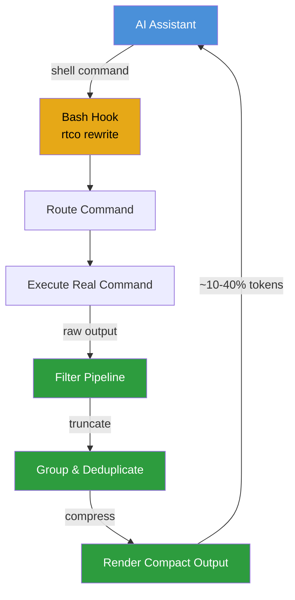

```
┌─────────────────────────────────────────────────────────────────────┐
│                                                                     │
│   ██████  ████████  ██████   ██████                                │
│   ██   ██    ██    ██    ██ ██    ██                               │
│   ██████     ██    ██    ██ ██    ██                               │
│   ██   ██    ██    ██    ██ ██    ██                               │
│   ██   ██    ██     ██████   ██████                                │
│                                                                     │
│   Rust Token Killer — v0.40.0                                      │
│   High-performance CLI proxy that reduces                          │
│   LLM token consumption by 60–90%                                  │
│                                                                     │
└─────────────────────────────────────────────────────────────────────┘
```

<p align="center">
  <a href="https://github.com/rtco-ai/rtco/actions/workflows/ci.yml"></a>
  <a href="https://github.com/rtco-ai/rtco/actions/workflows/release.yml"></a>
  <a href="https://github.com/rtco-ai/rtco/releases"></a>
  <a href="https://opensource.org/licenses/Apache-2.0"></a>
  <a href="https://github.com/rtco-ai/rtco/stargazers"></a>
</p>

---

## The Problem

AI coding assistants execute hundreds of shell commands per session. Every `cargo test`, `git status`, `npm install` fills your context window with noise you don't need — 60–90% of every token budget wasted on machine output.

## The Solution

**rtco** is a single Rust binary that intercepts shell commands and compresses their output before they reach your LLM context. Smart filtering, grouping, truncation, and deduplication — with <10ms overhead and zero behavior change in your workflow.

## Architecture

```
┌─────────────────────────────────────────────────────────────────────┐
│                         Your AI Assistant                          │
│                    (Claude Code / Copilot / Cursor)                 │
└──────────────────────────┬──────────────────────────────────────────┘
                           │
                           ▼
┌─────────────────────────────────────────────────────────────────────┐
│                         rtco Proxy Layer                            │
│                                                                     │
│  ┌──────────┐    ┌──────────┐    ┌──────────┐    ┌──────────────┐  │
│  │  Route   │───▶│  Filter  │───▶│  Compress│───▶│   Output     │  │
│  │ Command  │    │ Pipeline │    │  Engine  │    │   Renderer   │  │
│  └──────────┘    └──────────┘    └──────────┘    └──────────────┘  │
│       │                                                                │
│       ▼                                                             │
│  ┌──────────┐                                                      │
│  │  Execute │───▶ git / cargo / npm / docker / ...                  │
│  └──────────┘                                                      │
└─────────────────────────────────────────────────────────────────────┘
```



### How the Hook Works

```
Without rtco:                              With rtco:
┌─────────┐     ┌──────┐     ┌───┐        ┌─────────┐     ┌──────┐     ┌──────────┐     ┌───┐
│ Claude  │────▶│ bash │────▶│git│        │ Claude  │────▶│ bash │────▶│  rtco    │────▶│git│
└─────────┘     └──────┘     └───┘        └─────────┘     └──────┘     └──────────┘     └───┘
      ▲                       │                 ▲                       │          │
      │    ~2,000 tokens      │                 │    ~200 tokens        │  filter  │
      │    (full raw git      │                 │    (collapsed         │  +       │
      │     status output)    │                 │     git status)       │  compress│
      └───────────────────────┘                 └───────────────────────┴──────────┘
```

The hook transparently intercepts Bash commands and rewrites them to `rtco` equivalents. Your AI tool never knows — it just receives compact output.

## Quick Install

```bash
curl -fsSL https://raw.githubusercontent.com/rtco-ai/rtco/refs/heads/master/install.sh | sh
```

Or via Homebrew: `brew install rtco`

## Quick Start

```bash
# Install the auto-rewrite hook — commands transparently rewritten
rtco init -g                     # Claude Code / Copilot (default)
rtco init -g --gemini            # Gemini CLI
rtco init -g --agent cursor      # Cursor
rtco init -g --agent windsurf    # Windsurf

# Restart your AI tool. Then use it normally — output is automatically compressed.
git status        # → rtco git status (~1 line, not 15)
cargo test        # → rtco cargo test (failures only, not 200+ lines)
npm install       # → rtco pnpm install (compact output)

# Or call rtco directly
rtco gain         # Token savings summary
```

## Token Savings

| Operation      | Standard        | rtco            | Savings |
|----------------|-----------------|-----------------|---------|
| `git status`   | ~2,000 tokens   | ~200 tokens     | -80%    |
| `cargo test`   | ~25,000 tokens  | ~2,500 tokens   | -90%    |
| `pytest`       | ~8,000 tokens   | ~800 tokens     | -90%    |
| `git push`     | ~1,600 tokens   | ~120 tokens     | -92%    |

> Estimates based on medium-sized TypeScript/Rust projects. Actual savings vary.

## Supported Commands

**Git**: status, log, diff, add, commit, push, pull, branch, merge, stash  
**Test runners**: cargo test, pytest, jest, vitest, playwright, go test, rspec, rake  
**Build & lint**: cargo build, cargo clippy, ruff, golangci-lint, rubocop, tsc, prettier  
**Package managers**: npm, pnpm, pip, bundle, prisma, fnm  
**Containers**: docker ps/images/logs, kubectl pods/logs/services  
**Cloud**: aws sts/ec2/lambda/s3/iam/dynamodb/cloudformation  
**Files**: ls, read, find, grep, diff, tree, json, log, curl, wget, summary  

100+ commands supported. Run `rtco --help` for the full list.

## Filter Pipeline

When a command runs through rtco, its output passes through three stages:

```
Raw Output                  Filtered Output
─────────────────           ─────────────────
git log --oneline           ✓  abc1234 Fix navbar
abc1234 Fix navbar          ✓  def5678 Add auth
def5678 Add auth            ✓  def5678 Add auth          [truncated]
ghi9012 WIP                 ≈  1 duplicate removed
ghi9012 WIP                 ≈  1 progress line collapsed
jkl3456 Merge branch        ✗  3 skipped (info/debug)

                            ~72% token savings
```

1. **Route** — identifies the command and loads its filter rules
2. **Filter** — removes noise, collapses duplicates, truncates long lines
3. **Render** — produces compact output with savings summary

## Installation Methods

### Homebrew
```bash
brew install rtco
```

### Quick Install (Linux/macOS)
```bash
curl -fsSL https://raw.githubusercontent.com/rtco-ai/rtco/refs/heads/master/install.sh | sh
```

### Cargo
```bash
cargo install --git https://github.com/rtco-ai/rtco
```

### Pre-built Binaries
Download from [releases](https://github.com/rtco-ai/rtco/releases):
- macOS: `rtco-x86_64-apple-darwin.tar.gz`, `rtco-aarch64-apple-darwin.tar.gz`
- Linux: `rtco-x86_64-unknown-linux-musl.tar.gz`, `rtco-aarch64-unknown-linux-gnu.tar.gz`
- Windows: `rtco-x86_64-pc-windows-msvc.zip`

### Verify
```bash
rtco --version   # Should show rtco version
rtco gain        # Should show token savings stats
```

## Supported AI Tools

| Tool           | Install                         |
|----------------|---------------------------------|
| Claude Code    | `rtco init -g`                  |
| GitHub Copilot | `rtco init -g --copilot`        |
| Cursor         | `rtco init -g --agent cursor`   |
| Gemini CLI     | `rtco init -g --gemini`         |
| Windsurf       | `rtco init --agent windsurf`    |
| Cline / Roo Code | `rtco init --agent cline`    |
| Codex          | `rtco init -g --codex`          |
| Hermes         | `rtco init --agent hermes`      |
| Kilo Code      | `rtco init --agent kilocode`    |
| OpenCode       | `rtco init -g --opencode`       |

## Configuration

`~/.config/rtco/config.toml`:

```toml
[hooks]
exclude_commands = ["curl", "playwright"]  # skip rewrite for these

[tee]
enabled = true    # save raw output on failure (default: true)
mode = "failures" # "failures", "always", or "never"
```

When a command fails, rtco saves the full unfiltered output so the LLM can read it without re-executing.

## Uninstall

```bash
rtco init -g --uninstall  # Remove hook and config
cargo uninstall rtco       # Remove binary
brew uninstall rtco        # If installed via Homebrew
```

## Privacy

Telemetry is **disabled by default** and requires explicit opt-in. No data is ever sent without your consent. Run `rtco telemetry status` to check, `rtco telemetry enable` to opt in, `rtco telemetry disable` to withdraw.

## Project Structure

```
rtco/
├── src/
│   ├── main.rs              # Entrypoint & CLI routing
│   ├── cmds/                # Command-specific filters
│   │   ├── git/             # git status/log/diff/...
│   │   ├── cargo/           # cargo build/test/clippy/...
│   │   ├── npm/             # npm/pnpm install/test/...
│   │   ├── docker/          # docker ps/images/logs/...
│   │   └── ...
│   └── core/                # Shared infrastructure
│       ├── tracking.rs      # SQLite token tracking
│       ├── config.rs        # Config loading
│       └── filter.rs        # Filter pipeline engine
├── tests/
│   └── fixtures/            # Test output fixtures
├── scripts/                 # Build & test scripts
├── docs/                    # Architecture & contribution docs
├── Cargo.toml
└── README.md
```

## License

Apache License 2.0 — see [LICENSE](LICENSE) for details.

---

<div align="center">

[](https://star-history.com/#rtco-ai/rtco&Date)

</div>
